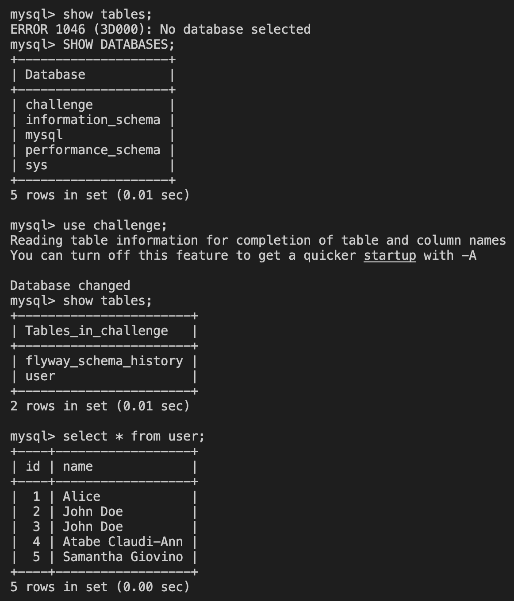

## Image Build and push

# I created a multi-stage, light weighted Dockerfile

# I created a build-and-push.yml for the CI pipeline;

mkdir -p .github/workflows/build-push.yml
brew install maven
mvn wrapper:wrapper

## Pipeline was created after a push

# You can see the pipeline [HERE](https://github.com/festuge/crewmeister-demo/actions/runs/12090707008/job/33718081003)

## crewmeister-helm: This directory Contains terraform files and a helm chart for the crewmeister-app
# After files were creates, I created a minikube cluster

brew install minikube
curl -LO https://storage.googleapis.com/minikube/releases/latest/minikube-darwin-amd64
sudo install minikube-darwin-amd64 /usr/local/bin/minikube
brew install hyperkit
brew install minikube
minikube config set driver hyperkit
minikube start --driver=hyperkit
minikube start --cpus=4 --memory=4096

# I then created my mysql database using helm with a mysql chart from bitnami in the default namespace;

helm upgrade --install mysql bitnami/mysql --version 12.1.0 \              
  --namespace default \
  --set auth.rootPassword=dev \
  --set auth.database=challenge \
  --set auth.username="" \
  --set auth.password="" \
  --set primary.persistence.enabled=false \
  --set primary.resources.requests.memory=256Mi \
  --set primary.resources.requests.cpu=500m \
  --set primary.resources.limits.memory=512Mi \
  --set primary.resources.limits.cpu=1 \
  --set secondary.enabled=false

# Then after, I applied my terraform configuration.

terraform init
terraform fmt
terraform validate
terraform apply

# Locally, I port-forwarded the service of the crewmeister-app on 9000:8080 and saw "It worked"

kubectl get svc
Kubectl port-forward svc/crewmeister-app 9000:8080

# I then added (POST) entries and read (GET) entries into the mysql database

curl -X POST http://localhost:9000/user \            
-H "Content-Type: application/json" \
-d '{"name": "Samantha Giovino", "email": "samantha.giovino@crewmeister.com"}'

curl -X GET "http://localhost:9000/user?id=5"

# I then exec into the mysql database to query the database 

kubectl get pods
kubectl exec -it mysql-0 -- sh
mysql -u root -p
SHOW DATABASES;
use challenge;
show tables;
select * from user;

# Here is a screenshot 